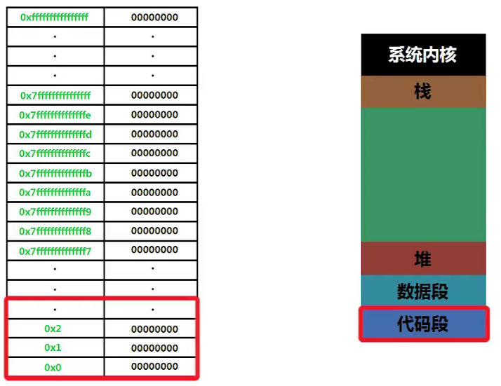
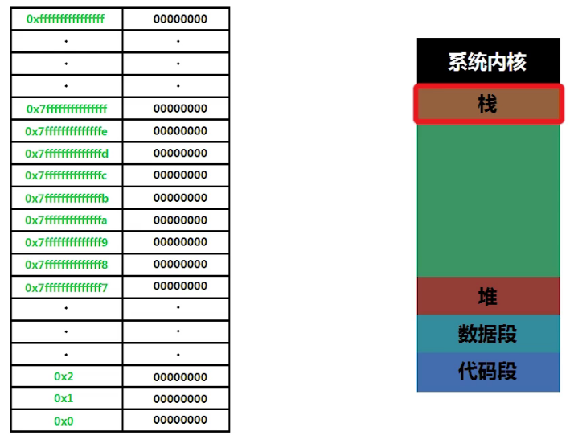

## C语言复习

变量的本质是什么？

> 变量名它只是一个代号
>
> 变量的本质就是内存



C语言语法是不允许我们直接操作代码段的

除了代码编译后存在代码段以外

当前调用哪个函数

当前调用的函数运行到多少行

并且这个函数中有哪些变量，这些变量的值是什么

这些内容都记录到内存的 `栈` 中



比如记录我们当前代码运行到了26行

```
Temporary breakpoint 1, main () at main.c:23
23	{
(gdb) n
24	    int a = 3;
(gdb) 
25	    int b = 4;
(gdb) 
26	    int *pa = &a;
(gdb) 
```

比如 `p a`

是因为我们在栈内存中已经被记录下来了

每次调用一个函数，就会在内存中分配一个 `栈内存`

```c
(gdb) p &a
$4 = (int *) 0x7fffffffde6c
```

这就是记录的内存地址


## c语言中所有的变量都有类型

`int` 类型就保存整数

`double` 类型就保存的双精度的浮点数


那么指针保存的是什么呢？

指针保存的就是内存地址


