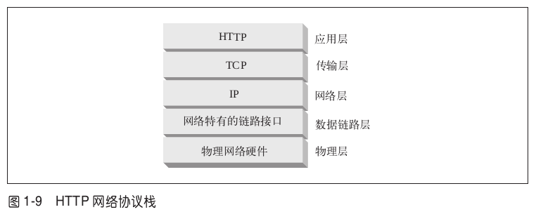

## TCP/IP

HTTP 是个应用层协议。HTTP 无需操心网络通信的具体细节;它把联网的细节都
交给了通用、可靠的因特网传输协议 TCP/IP。
11
TCP 提供了:

• 无差错的数据传输;
• 按序传输(数据总是会按照发送的顺序到达);
• 未分段的数据流(可以在任意时刻以任意尺寸将数据发送出去)。

因特网自身就是基于 TCP/IP 的,TCP/IP 是全世界的计算机和网络设备常用的层次
化分组交换网络协议集。TCP/IP 隐藏了各种网络和硬件的特点及弱点,使各种类型
的计算机和网络都能够进行可靠地通信。
只要建立了 TCP 连接,客户端和服务器之间的报文交换就不会丢失、不会被破坏,
也不会在接收时出现错序了。
用网络术语来说,HTTP 协议位于 TCP 的上层。HTTP 使用 TCP 来传输其报文数据。与之类似,TCP 则位于 IP 的上层(参见图 1-9)。

